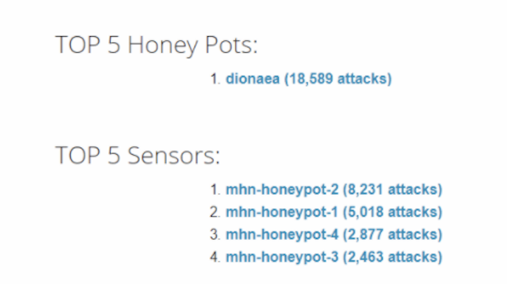
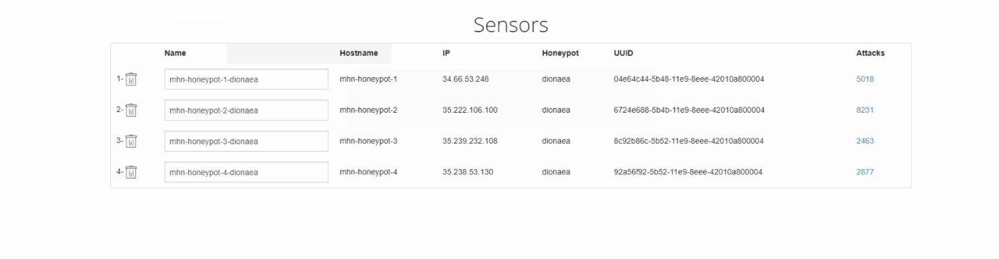

# week10codepath

Time Spent: 10 Hours-12 Hours

> Honeypot that was deployed 
Only one Honeypot as a dionaea 

> Issues: None, but some editing ones (using family computer, mine is being repaired) 

> Summary of Attacks 

